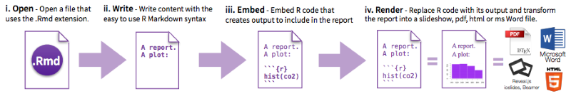

# Overview

\tableofcontents[hideallsubsections]


<!--
CI-dessous les capsules de paramétrage du document

1. capsule pour définir la taille de police dans les outputs R
2. format par défaut des comportements des capsules 
3. Chargement des packages
4. Marqueur de section invisible dans le texte
-->

```{r, echo=FALSE}
# Permit to define 'size="tiny" or other in chunk
def.chunk.hook  <- knitr::knit_hooks$get("chunk")
knitr::knit_hooks$set(chunk = function(x, options) {
  x <- def.chunk.hook(x, options)
  ifelse(options$size != "normalsize", paste0("\n \\", options$size,"\n\n", x, "\n\n \\normalsize"), x)
})
#################
# Knitr options #
#################
knitr::opts_chunk$set(fig.align = "center", message=FALSE, warning=FALSE, paged.print=FALSE, size="footnotesize" )
```


```{r Packages, echo= FALSE, include = FALSE, warning=FALSE}
####################
# Packages and AUX #
####################
library(tidyverse)
library(ggpubr)
library(knitr)
```


```{r echo = FALSE, eval = FALSE}
############################################################################
#############################   Introduction   ##################
############################################################################
```


# Quelques basiques

## Le préambule

- sur les 30 1ères lignes, on définit les paramètres du document
- il est important de bien respecter le format de cette partie, jusque dans le nombre d'espaces, l'indentation des paragraphes, etc

## Le corps du texte

- on définit les sections et sous-sections avec des `#`, `##`, `###`
- un slide de section est créé pour un titre de niveau 1 : un seul `#`
- un nouveau slide est créé pour un titre de niveau 2 : un seul `##`
- un niveau 3 correspond à un gros titre mais ne change pas de slide

- on passe à la page suivante avec `***`
- on met de l'*italique* avec `*texte*` du **gras** avec `**texte**`
- on ~~barre~~ avec `~~texte~~`

# Les équations
## Les équations en lignes

Pour ajouter une équation dans un paragraphe, en ligne, avec un `$` :`$\sqrt{x^2}$` renvoie $\sqrt{x^2}$

## Equations seules

Pour définir une équation sur une ligne seule avec deux `$$`

par ex:

`$$\frac{exp(\beta_i x_{ij})}{\sum_{j=1}^J exp(\beta_j)}$$` renvoie:

$$\frac{exp(\beta_i x_{ij})}{\sum_{j=1}^J exp(\beta_j)}$$

# Les images et graphiques
## Ajouter une images depuis un fichier

Une source utile pour l'approfondissement : 

+ http://zevross.com/blog/2017/06/19/tips-and-tricks-for-working-with-images-and-figures-in-r-markdown-documents/

`![Rmarkdown comme une plateforme [^1]](Fichiers_Aux/Rmd_output.png)`

`[^1]: https://reproducible-analysis-workshop.readthedocs.io/en/latest/6.RMarkdown-knitr.html`

***

![Rmarkdown comme une plateforme [^1]](Fichiers_Aux/Rmd_output.png){ width=50% }

[^1]: https://reproducible-analysis-workshop.readthedocs.io/en/latest/6.RMarkdown-knitr.html

***

Ou encore


    ```{r  out.width = "50%", fig.cap="Workflow"}`r ''`
     
    ```
    
```{r  echo=F, out.width = "50%", fig.cap="Workflow"}
 
```


# Ajout d'un fichier auxiliaire contenant des traitements

## Ajouter un fichier auxiliaire

On peut ajouter un fichier auxiliaire qui sera executé et ajouté au document par :

    ```{r  child='Fichiers_Aux/MonTraitement.Rmd'}`r ''`
    ```

Cela ajoute les éléments suivants.

voir le fichier pour voir les différentes manipulations.

***

<!-- regression modeling   -->
```{r child='Fichiers_Aux/MonTraitement.Rmd'}
```


***

## Bibliography {.allowframebreaks}

